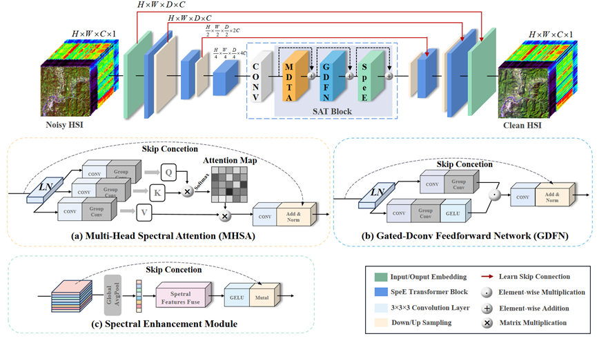
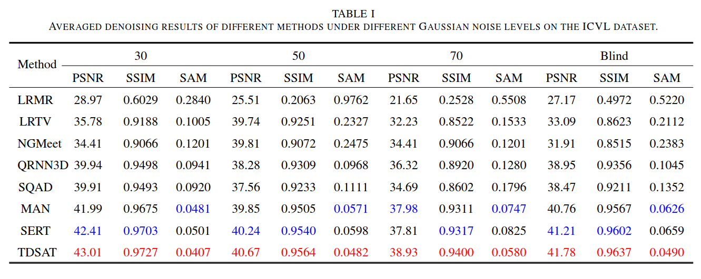
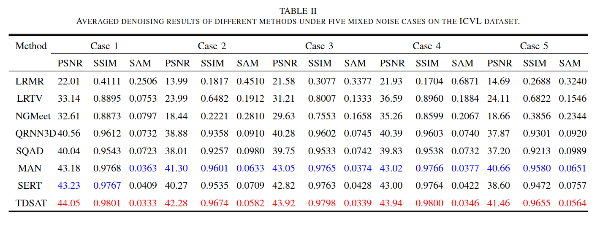
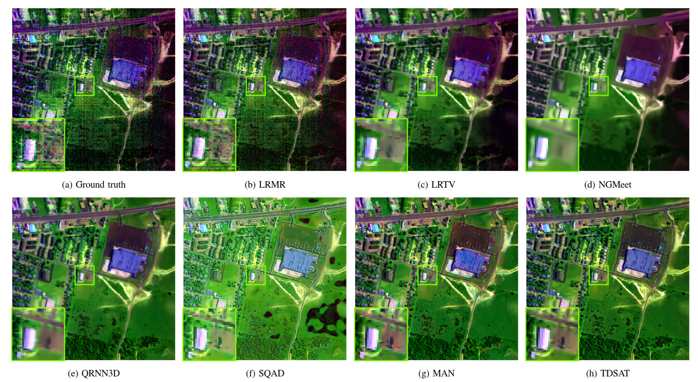

# Three-Dimension Spatial-Spectral Attention Transformer for Hyperspectral Image Denoising

Qiang Zhang, Yushuai Dong, Yaming Zheng, Haoyang Yu*, Qiangqiang Yuan

[[code]](http://arxiv.org/) [[paper(arXiv)]](http://arxiv.org/)

<hr />

> **Abstract:** Hyperspectral image (HSI) denoising is a crucial step for its subsequent applications. In this paper, we propose a three-dimensional spatial-spectral attention Transformer model, referred to as TDSAT, for HSI denoising. The core object of this model is to delve the inherent characteristics of HSI in both spectral and spatial dimension, learn the relationships among different bands, and preserve high-quality spectral and spatial information for denoising. The proposed method consists of three main components: the multi-head spectral attention module (MHSA), the gated-dconv feedforward network module (GDFN), and the spectral enhancement module (SpeE). In this model, the MHSA module learns the relationships among different bands and emphasizes the local spatial information. The GDFN module explores more expressive and discriminative spectral features. The SpeE module enhances the perception of subtle differences between different spectrums. Moreover, the proposed method combines three-dimensional convolution and spectral-spatial attention Transformer blocks, enabling denoising of HSI with arbitrary number of bands. Furthermore, TDSAT is lightweight and efficient, with favorable performance and low computational cost. Simulation and real experiments demonstrate that TDSAT outperforms on visual quality and evaluation metrics, compared with existing SOTA HSI denoising methods.
<hr />

## Network Architecture
 

## Installation
```
git clone https://github.com/
cd TDSAT
pip install -r requirements.txt
```

## Contents
1. [Models](#Models)
1. [Datasets](#Datasets)
1. [Training and Testing](#Training)
1. [Results](#Results)


## Models

We provided pre-trained models in ```pretrained/model_epoch_50.pth```

## Datasets

### Preparing training/testing/validating datasets

1. Firstly, download [ICVL hyperspectral images](https://icvl.cs.bgu.ac.il/hyperspectral/) into ```data/ICVL/filefolder``` folder and make sure your initial data are in the following structure. 
2. Secondly, spilt data. Use the function  ```move_data()``` in ```python hsi_data.py```, split the entire dataset into training , testing and validating. The train-validation-test  split can be found in ```train_fns.txt``` , ```validation_fns_*.txt``` and  ```test_fns_*.txt```. You can also create the split by yourself or by the function  ```creat_train_val_test``` in ``` python hsi_data.py``` and spilt data.
3. Modify and run the function  ```create_icvl64_31()``` in ```python hsi_data.py``` create training set. 
4. Modify and run the matlab code matlab/HSIValData.m and matlab/HSITestData.m to create validation and testing sets. 


## Training and Testing
### 1. Training with ICVL datasets

```python hsi_train.py -a tdsat -p train -d ./data/ICVL/trainset/ICVL64_31.npz -v ./data/ICVL/valset_gauss --gpu-ids 0```

### 2. Testing with pretrained models
Read and modify input path in ```hsi_test.py```/```hsi_real.py```

* [Simulation Dataset]:   
```python hsi_test.py -a tdsat -r -rp ./pretrained/model_epoch_50.pth --gpu-ids 0```

* [Realistic Dataset]:  
```python hsi_real.py -a tdsat  -r -rp ./pretrained/model_epoch_50.pth --gpu-ids 0```


<a id="Results"></a>


## Results
Experiments are performed on different datasetas, including ICVL dataset (Gaussian noise and Complex noise), EO-1 dataset, GF-5 dataset, and Urban dataset. 

<details>
<summary><strong>Gaussian noise on ICVL dataset</strong> (click to expand) </summary>

 
</details>

<details>
<summary><strong>Complex noise on ICVL dataset</strong> (click to expand) </summary>

 
</details>
<details>
<summary><strong>Real data Denoising</strong> (click to expand) </summary>
 
</details>


## Citations

If you find the code helpful in your resarch or work, please cite the following paper(s).

```

```
## Acknowledgement
The codes are based on [QRNN3D](https://github.com/Vandermode/QRNN3D).